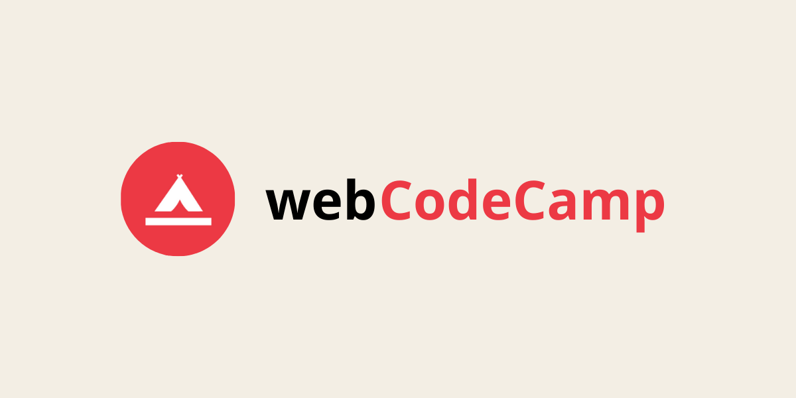

# webCodeCamp

A free online web development coding bootcamp 

## Run Locally

Clone the project

```bash
  git clone https://github.com/zaidmukaddam/webCodeCamp.git
```

Go to the project directory

```bash
  cd webCodeCamp
```

Install dependencies

```bash
  npm install
```

Create an .env file in root and add your variables

```
  NEXT_PUBLIC_CLERK_FRONTEND_API=
  CLERK_API_KEY=
  MONGODB_URI=
```

Start the app

```bash
  npm run dev
```

## Tech Stack

- **NextJS**

- **MongoDB**

- **Clerk**

- **Vercel**

## Author

[Zaid Mukaddam](https://www.github.com/zaidmukaddam)
